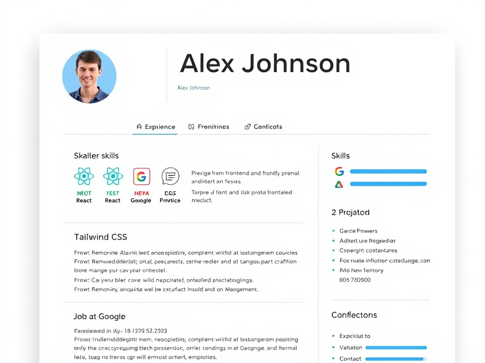

# Portfolio — صفحه پورتفولیو و رزومه



این پروژه یک صفحه پورتفولیوی **تک‌فایلی**، **واکنش‌گرا** و **سبک** برای توسعه‌دهندگان فرانت‌اند است. صفحه شامل بخش‌های تجربیات کاری، پروژه‌ها، مهارت‌ها و اطلاعات تماس است و بدون هیچ‌گونه نصب یا مرحله Build مستقیم در مرورگر اجرا می‌شود.

## 🚀 پیش‌نمایش زنده

پس از فعال‌سازی GitHub Pages، صفحه از این آدرس در دسترس است:

> **https://movtigroup.github.io/profile_html/**

## ✨ ویژگی‌ها

- طراحی واکنش‌گرا با استفاده از **Tailwind CSS**
- تب‌بندی محتوا (تجربه / پروژه‌ها / تماس) با استفاده از **jQuery**
- نوار پیشرفت برای نمایش سطح مهارت‌ها در سایدبار
- بخش معرفی مهارت‌ها با آیکون و برچسب رنگی
- کارت‌های تجربه کاری و لیست پروژه‌ها
- بخش اطلاعات تماس (ایمیل و لینکدین)
- بدون نیاز به Build، Node.js یا هیچ وابستگی محلی

## 🛠 فناوری‌های استفاده‌شده

| فناوری | نقش |
|---|---|
| HTML5 | ساختار صفحه |
| [Tailwind CSS](https://tailwindcss.com/) (CDN) | استایل‌دهی و ریسپانسیو |
| [jQuery](https://jquery.com/) | مدیریت تب‌ها و تعاملات |
| GitHub Actions + Jekyll | بیلد و انتشار خودکار سایت |

## 📦 نصب و راه‌اندازی

1. مخزن را کلون کنید:

   ```bash
   git clone https://github.com/movtigroup/profile_html.git
   cd profile_html
   ```

2. فایل `index.html` را در مرورگر باز کنید — همین! 🎉

   ```bash
   # در ویندوز
   start index.html

   # در لینوکس / مک
   open index.html
   ```

هیچ نصب وابستگی یا سرور محلی لازم نیست؛ همه چیز از CDN بارگذاری می‌شود.

## 📁 ساختار پروژه

```
profile_html/
├── index.html                      # صفحه اصلی پورتفولیو
├── doc/
│   └── index.html                  # نسخه نمونه / دمو
├── img/
│   ├── a_professional_res_image.png  # تصویر پیش‌نمایش
│   └── download.png                  # عکس پروفایل
├── .github/
│   └── workflows/
│       └── jekyll-docker.yml       # workflow بیلد خودکار Jekyll
├── MIT                             # لایسنس MIT
└── README.md
```

## 🎨 شخصی‌سازی

برای استفاده از این قالب برای خودتان، این بخش‌ها را در `index.html` ویرایش کنید:

| چه چیزی | کجا |
|---|---|
| نام و عنوان شغلی | تگ‌های `<h1>` و `<p>` در بخش Profile Header |
| عکس پروفایل | فایل `img/download.png` یا مسیر `src` تصویر |
| مهارت‌ها (برچسب‌ها) | بخش **Skills** در تب Experience |
| نوار پیشرفت مهارت‌ها | بخش **Sidebar** (مقدار `width` و درصد) |
| تجربیات کاری | بخش **Work Experience** |
| پروژه‌ها | تب **Frontlines** و لیست Projects در سایدبار |
| ایمیل و لینکدین | تب **Contacts** |

## 🌐 انتشار روی GitHub Pages

این مخزن شامل یک workflow آماده در مسیر `.github/workflows/jekyll-docker.yml` است که سایت را با Jekyll بیلد می‌کند. برای فعال‌سازی انتشار:

1. به **Settings → Pages** در مخزن بروید.
2. در قسمت Source، برنچ `main` را انتخاب کنید.
3. سایت روی آدرس `https://movtigroup.github.io/profile_html/` منتشر می‌شود.

## 🤝 مشارکت

ایجاد Issue یا Pull Request برای بهبود طراحی یا افزودن قابلیت‌های جدید خوش‌آمدگویید.

## 📄 لایسنس

این پروژه تحت لایسنس [MIT](MIT) منتشر شده است — © 2025 MovtiGroup
